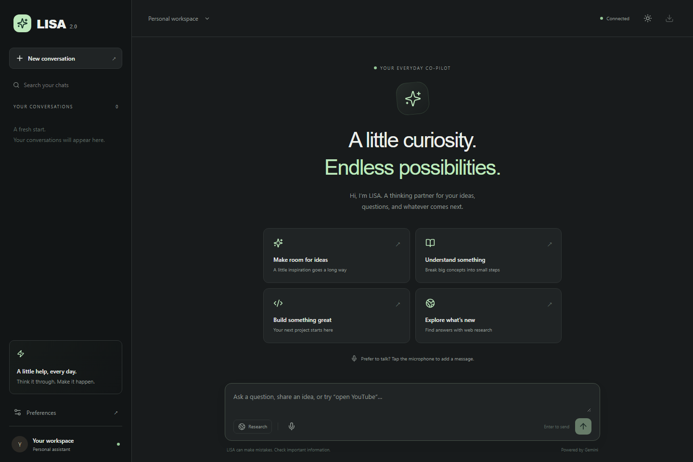

# LISA 2.0 — Your personal AI workspace

[](https://github.com/prabhteshmishra4567/LISA-2.0/actions/workflows/ci.yml)

LISA helps you think through ideas, ask follow-up questions, research current information, and handle everyday browser tasks. Built with React, Express, Google's Gemini API, and SQLite.



[View the mobile interface](docs/lisa-mobile.png).

## What's included

- Responsive workspace with dark and light themes, searchable history, starter prompts, and keyboard controls.
- Persistent conversations: create, rename, delete, revisit, and export chats as Markdown.
- Follow-up memory: the last 20 complete turns, within a 48,000-character context budget, are sent to Gemini.
- Markdown answers with code blocks, tables, safe links, copy controls, and optional read-aloud.
- Research mode uses Gemini's Google Search grounding and displays returned sources and Google Search suggestions. Search availability depends on the configured model and API account; Gemini decides when to use the search tool.
- Voice dictation with English (US), English (India), and Hindi preferences. Speech is placed in the composer for review before sending. Voice recognition depends on browser support and microphone permission; typed chat works independently.
- Everyday commands: `open YouTube`, `open Spotify`, `open Google`, `open GitHub`, `search for ...`, `time`, `date`, and `tell me a joke`. These work without an AI key. Browser actions return a link you can click; they do not launch native desktop applications.
- Stop pending requests, retry failed questions, and receive clear configuration, quota, and network errors.
- GitHub CI for lint, builds, backend tests, browser tests, and dependency audits. Dependabot proposes weekly dependency and Actions updates.

## Run locally

Install **Node.js 24 or newer**. The backend uses Node's built-in SQLite module, so MySQL and native SQLite build tools are unnecessary.

In one terminal:

```powershell
cd lisa2-backend
npm install
Copy-Item .env.example .env
# Edit .env and set GEMINI_API_KEY before starting.
npm start
```

If you already have `.env`, keep it and update its settings instead of overwriting it. Create an API key in [Google AI Studio](https://aistudio.google.com/apikey). The model defaults to `gemini-flash-latest`; set `GEMINI_MODEL` to a specific available model ID to pin behavior. API usage, including research, is subject to Google's pricing and quotas. The [Google Gen AI SDK documentation](https://googleapis.github.io/js-genai/release_docs/index.html) describes model calls, and [Google Search grounding documentation](https://ai.google.dev/gemini-api/docs/google-search) covers research behavior.

In another terminal:

```powershell
cd lisa-frontend
npm install
npm run dev
```

Open **http://127.0.0.1:5173**. Vite forwards `/api` requests to the backend at `127.0.0.1:5000`. On Windows, use `npm.cmd` instead of `npm` if PowerShell blocks npm scripts.

`GEMINI_API_KEY` stays on the backend. Restart the backend after changing its `.env`. Local commands and conversation management work before the key is configured.

## Configuration and data

Backend settings are documented in [lisa2-backend/.env.example](lisa2-backend/.env.example). `DATABASE_PATH` defaults to `lisa2-backend/lisa_ai.db` regardless of the terminal's working directory. Existing legacy `conversations` tables are preserved; the upgraded interface uses new `sessions` and `messages` tables. Old logs remain in the local database as an archive rather than being assigned to an arbitrary browser.

Each browser receives a random client ID stored locally. It acts as a bearer credential for that browser's conversations; preserve browser storage to retain access. Clearing browser storage generates a new identity. This is designed for a local personal workspace, not public multi-user hosting. The API binds to loopback by default and checks allowed origins; public hosting requires proper user authentication and HTTPS.

For a separately hosted frontend, set `VITE_API_URL` to the backend origin before building and add the frontend origin to `ALLOWED_ORIGINS` on the backend. Development uses port 5173 with `strictPort` so origin configuration stays consistent. The production frontend is built with `npm run build`; a host must serve its `dist` directory and provide access to the backend. This repository's CI verifies builds; it does not deploy them.

AI turns are saved together only after a successful response. Cancellation discards that pending turn; provider-side computation and usage charges may still occur. Chats are sent to Google for AI responses and remain in the local database for history. Never commit keys or personal chat databases.

**Existing installations:** `.env` and chat databases were tracked in older commits. They are now excluded from new commits. Rotate any previously committed Gemini API key in Google AI Studio; removing a file from the current branch does not remove it from Git history. Local database files are preserved during this upgrade.

## Verification

```powershell
cd lisa2-backend
npm run check
npm test
npm audit --omit=dev --audit-level=high
```

```powershell
cd lisa-frontend
npm run lint
npm run build
npm audit --audit-level=high
npx playwright install chromium
npm run test:e2e
```

Browser tests start an isolated mock backend with an in-memory database; no Gemini key or real chat history is used. Stop any existing servers on ports 5000 and 5173 before running them. Tests cover persistence, context, Markdown, research sources, export, rename/delete, failure recovery, cancellation, voice fallback/dictation, theme persistence, and mobile layout.

## Keeping GitHub updated

Pushes to `main` and pull requests run the [LISA checks workflow](.github/workflows/ci.yml). It also runs each Monday at **9:00 AM India time** and can be started manually. [Dependabot](.github/dependabot.yml) opens weekly update pull requests for both npm projects and GitHub Actions. Review and merge passing updates; changes are not automatically merged or deployed. Feature development still requires intentional code changes and commits.

## Project layout

```text
lisa-frontend/          React workspace, Vite, Playwright browser tests
lisa2-backend/          Express API, SQLite storage, Gemini adapter, backend tests
.github/workflows/     Automated verification
.github/dependabot.yml Weekly dependency-update proposals
```

Original project by **Prabhtesh Mishra** — [GitHub](https://github.com/prabhteshmishra4567), [LinkedIn](https://www.linkedin.com/in/prabhteshmishra4567). Built for education and personal development.
